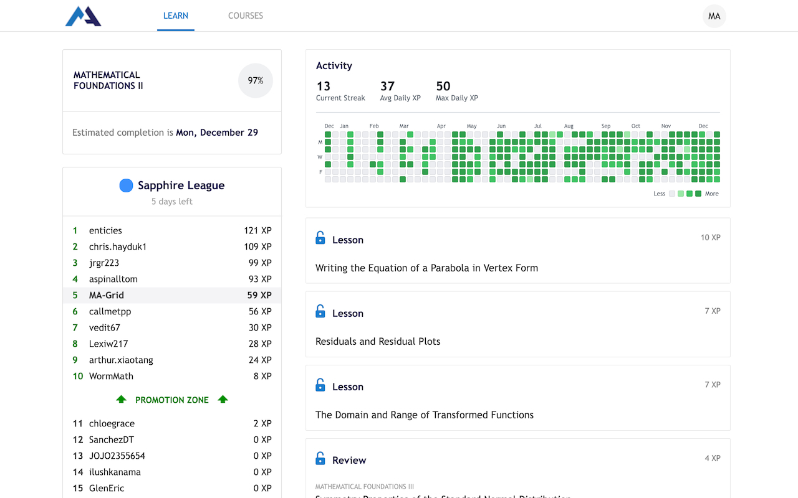
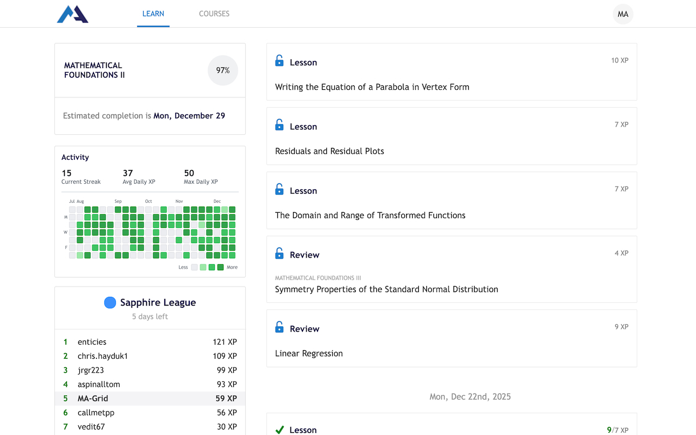

#  MA Grid

MA Grid is a web extension that displays a GitHub-style activity graph on Math Academy. It also includes some basic settings for placement (main feed or sidebar), an option to hide the existing XP tracker, and a button to clear cache.

This project is still in very early development. If you have any feature ideas or bugs, you're welcome to open an issue.

<a href="https://chromewebstore.google.com/detail/ma-grid/dbjdnjifbemgnefeidoeicnjhdlanflh"></a>
<a href="https://addons.mozilla.org/en-US/firefox/addon/ma-grid/"></a>

# Screenshots

<table>
  <tr>
    <td></td>
    <td></td>
  </tr>
</table>

# Development

If you want to contribute, here's how you can get started.

```sh
bun i     # install packages
bun wxt   # launch wxt, opens chrome with extension loaded
```

From there, you can login and navigate to the dashboard to view the heatmap.
