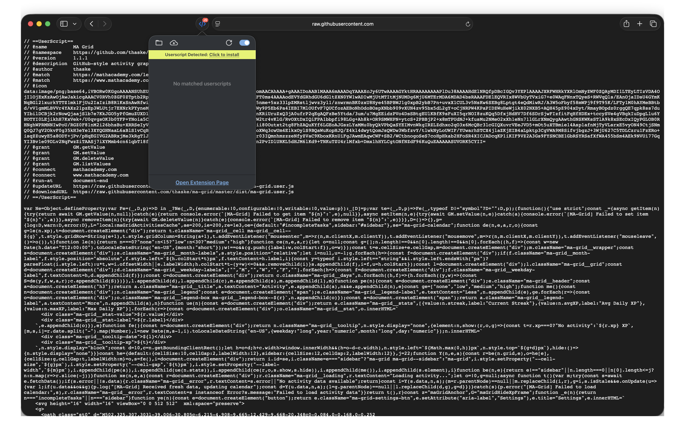
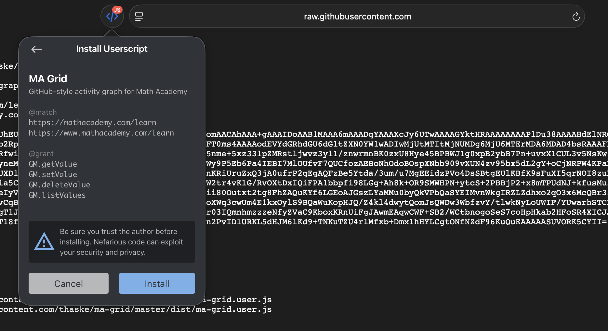

#  MA Grid

MA Grid is a web extension that displays a GitHub-style activity graph on Math Academy. It also includes some basic settings for placement (main feed or sidebar), an option to hide the existing XP tracker, and a button to clear cache.

This project is still in very early development. If you have any feature ideas or bugs, you're welcome to open an issue.

<a href="https://chromewebstore.google.com/detail/ma-grid/dbjdnjifbemgnefeidoeicnjhdlanflh"></a>
<a href="https://addons.mozilla.org/en-US/firefox/addon/ma-grid/"></a>

For Safari, please see the [Safari Installation](#safari-installation) section below.

# Screenshots

<table>
  <tr>
    <td></td>
    <td></td>
  </tr>
</table>

# Safari Installation

For Safari, you can install MA Grid as a userscript. This should work on iOS, iPadOS, and macOS.

1. Install [Userscripts](https://apps.apple.com/us/app/userscripts/id1463298887) from the App Store

2. Install the userscript:
   - Navigate to https://raw.githubusercontent.com/thaske/ma-grid/refs/heads/master/dist/ma-grid.user.js
   - Click the Userscripts extension popup and select **Userscript Detected: Click to install**
   - In the installation dialog, review the script details and click **Install** to confirm

   
   

# Development

If you want to contribute, here's how you can get started.

```sh
bun i     # install packages
bun wxt   # launch wxt, opens chrome with extension loaded
```

From there, you can login and navigate to the dashboard to view the graph.
